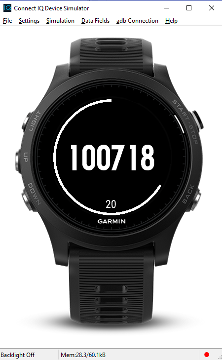

Garmin Connect IQ TOTP App - Proof of Concept
=============================================

This is a Garmin Connect IQ Widget that implements RFC 6238 - the TOTP Algorithm, or more popularly known as one-time-passwords:
https://tools.ietf.org/html/rfc6238

A popular implementation of this RFC is the [Google Authenticator](https://github.com/google/google-authenticator) mobile app.

This code implements a **proof-of-concept** Garmin Connect IQ Widget, that takes a **hard-coded key** and generates one-time passwords in the same manner as the Google Authenticator app.

I've provided the sample keys/secrets that are used to seed the OTPs; you can input these into an app like Google Authenticator to verify that this implementation is correct.

Warning - Use at your own risk!
-------------------------------

1. I wrote most of this code in early June 2017, (using the 2.2.6/2.3.1 SDK versions) before [Connect IQ 3.0.1](https://developer.garmin.com/index.php/blog/post/connect-iq-3.0.1-now-available) was released on 2018-08-16.
**This release added a [Cryptography API](https://developer.garmin.com/downloads/connect-iq/monkey-c/doc/Toybox/Cryptography.html) that provided all of the primitives (SHA-1, HMAC) that previously were not available, and that I had to implement**. Obviously, using these built-in crypto primitives should be used, but my own home-rolled implementation remains for educational purposes. You should not rely upon these, and an obvious improvement is to change the code to use the SDK-provided Cryptography APIs.
2. The project was updated to add `monkey.jungle` just so that it would build under Connect IQ 3.0.1, but **was not updated to take advantage of the new Crypto APIs**.
3. The aim of this project was to get a working proof-of-concept TOTP application on the Connect IQ platform, and as such, **it is not a complete TOTP solution**. For example, there is currently no way to securely transfer the key/shared secret to the device, as it's just hard-coded. Future improvements could include using the Communications/BLE APIs to accomplish this.

Screenshots:
------------

Supported Devices:
------------------
I tested this on my Forerunner 935 and it worked fine. Thus, it should run fine on any Fenix 5/Fenix 5 Plus series watch, or any Garmin device that supports a minimum of Connect IQ 2.x. However, I haven't actually tested it on anything other than my Forerunner 935.

Future Improvements:
--------------------
These may or may not be coming:

- Update to use the Cryptography APIs in Connect IQ 3.0.1 instead of home-rolled crypto primitives.
- Add in support for multiple keys/profiles.
- Add in a mechanism to transfer the keys securely to the device, possibly using the Communications/BLE APIs.
- Support the [KeyUri](https://github.com/google/google-authenticator/wiki/Key-Uri-Format) format and display label/provider/account details.
